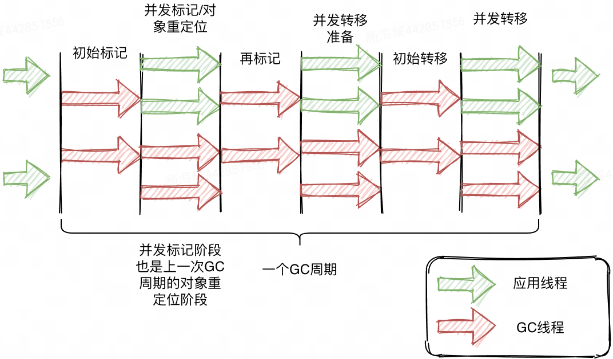

# 2024犀牛鸟 G1 VS ZGC

## GC 分析

首先，我先按照自己的理解，对 G1 GC 和 ZGC 进行一个介绍，然后对他们在堆大小，停顿时间和吞吐量方面的差异进行分析。

### G1 介绍

对于 G1 来说，它不仅追求低停顿，并且希望可以建立一个可预测的停顿时间模型，让用户明确指定在某一个时间段内完成 GC。

我认为 G1  非常有创意的点在于引入了 “Region” 的概念，不再物理隔离新生代和老年代，将堆分成了大小相等的独立区域，这样的话，我们就可以对每个区域独立回收，这样使得可预测成为了可能，通过记录每个 Region 垃圾回收的时间以及回收所收获的空间，并维护一个优先列表，我们就可以做到每次回收的时候，根据允许的收集时间，优先回收价值最大的 Region 块。这样细化的划分，把内存化整为零，要比新生代老年代更加的精细化，也可以带来更多的收益。

G1 的分区采用了 Region 的思路，将整个堆空间分成了大小相等的内存区域，每次分配对象空间将逐段的使用内存。每个 Region 不指定为某个代服务，可以按需在新生代和老年代之间切换。在每个 Region 的内部，又分为了若干个 512 Byte 的 Card，Card 是标识堆内存的最小可用粒度，所有 Region 的 Card 都会被记录在全局卡片表（ Global Card Table）中。每次对内存的回收，实际都是对指定 Region 的 Card 进行处理。G1 对内存的使用以 Region 为单位，而对对象的分配以 Card 为单位。

对于 G1 的分区模型，存在以下几个概念：

1. 巨型对象（ Humongous Region ）
   
    巨型对象就是说这个对象的大小已经超过了 Region 的一半，这种对象的移动成本很高，而且有可能一个 Region 不能容纳一个巨型对象，所以不能之间在 TLAB 中进行分配，而是直接在老年代分配。
    
2. 已记忆集合（ Remember Set / RSet ）
   
    每个 Region 都有一个 RSet，用来记录该 Region 对象的引用对象所在的 Region。通过使用 RSet，在做可达性分析的时候就可以避免全堆扫描，RSet 类似一个反向指针，只需要扫描 RSet 就可以确定本分区内的对象是否存活，进而确定本分区的对象存活情况。
    
3. Per Region Table（PRT）
   
    RSet 内部使用 PRT 记录分区的引用情况。为了区分热点的 Region 和 非热点的 Region，PRT 分了三种模式记录引用（稀少、细粒度、粗粒度），依次占用更少的空间，记录更少的内容。
    

G1 也存在分代的思想，G1 将内存在逻辑上划分为年轻代和老年代，其中年轻代又划分为Eden空间和Survivor空间。但年轻代空间并不是固定不变的，当现有年轻代分区占满时，JVM会分配新的空闲分区加入到年轻代空间。而由于分区的思想，每个应用线程和 GC 线程都会使用独立的使用分区，不用顾及分区是否连续，进而可以减少同步时间，这种独立的分区就是本地分配缓冲区（Lab）。

其中，应用线程可以独占一个本地缓冲区（ TLAB ）来创建的对象，而大部分都会落入Eden区域（巨型对象或分配失败除外）；而每次垃圾收集时，每个GC线程同样可以独占一个本地缓冲区（GCLAB）用来转移对象，每次回收会将对象复制到Suvivor空间或老年代空间；对于从Eden/Survivor空间晋升（ Promotion ）到Survivor/老年代空间的对象，同样有GC独占的本地缓冲区进行操作，该部分称为晋升本地缓冲区（ PLAB ）。

收集集合（ CSet ）代表每次GC暂停时回收的一系列目标分区。在任意一次收集暂停中，CSet所有分区都会被释放，内部存活的对象都会被转移到分配的空闲分区中。CSet 可以分为年轻代收集集合和混合收集集合。无论是年轻代收集，还是混合收集，工作的机制都是一致的。年轻代收集CSet只容纳年轻代分区，而混合收集会通过启发式算法，在老年代候选回收分区中，筛选出回收收益最高的分区添加到CSet中。

STAB（起始快照算法），它主要针对标记-清除垃圾收集器的并发标记阶段，非常适合G1的分区块的堆结构，同时解决了CMS的主要烦恼：重新标记暂停时间长带来的潜在风险。SATB会创建一个对象图，相当于堆的逻辑快照，从而确保并发标记阶段所有的垃圾对象都能通过快照被鉴别出来。当赋值语句发生时，应用将会改变了它的对象图，那么JVM需要记录被覆盖的对象。因此写前栅栏会在引用变更前，将值记录在SATB日志或缓冲区中。每个线程都会独占一个SATB缓冲区，初始有256条记录空间。当空间用尽时，线程会分配新的SATB缓冲区继续使用，而原有的缓冲去则加入全局列表中。最终在并发标记阶段，并发标记线程在标记的同时，还会定期检查和处理全局缓冲区列表的记录，然后根据标记位图分片的标记位，扫描引用字段来更新RSet。

对于 RSet 的维护，主要用到了写栅栏和并发优化线程。栅栏是指在原生代码段中，某些语句运行时，栅栏代码也会执行。G1 会在赋值语句中，使用写前栅栏和写后栅栏。而并发优化线程指的是只专注扫描日志缓冲区记录的卡片来维护更新RSet，并发优化线程永远是活跃的，一旦发现全局列表有记录存在，就开始并发处理。

对于 RSet 的维护，主要用到了写栅栏和并发优化线程。栅栏是指在原生代码段中，某些语句运行时，栅栏代码也会执行。G1 会在赋值语句中，使用写前栅栏和写后栅栏。而并发优化线程指的是只专注扫描日志缓冲区记录的卡片来维护更新RSet，并发优化线程永远是活跃的，一旦发现全局列表有记录存在，就开始并发处理。

G1 的垃圾收集过程主要是 4 个步骤：

初始标记 ➡️ 并发标记 ➡️ 最终标记 ➡️ 筛选回收。

其中最终标记主要是为了修正在并发标记期间因用户程序继续运作而导致标记产生变动的那一部分标记记录，虚拟机将这段时间对象变化记录在线程的 RSet Logs 里面，最终标记阶段需要把 RSet Logs 的数据合并到 RSet 中。这阶段需要停顿线程，但是可并行执行。

筛选回收的过程主要是首先对各个 Region 中的回收价值和成本进行排序，根据用户所期望的 GC 停顿时间来制定回收计划。此阶段其实也可以做到与用户程序一起并发执行，但是因为只回收一部分 Region，时间是用户可控制的，而且停顿用户线程将大幅度提高收集效率。

### ZGC 介绍

下面来说下另一种要探讨的GC —— ZGC。ZGC 是在 JDK 11 中推出的一款垃圾收集器，它的设计目标主要是适用了大内存低延迟服务的内存管理和回收。它可以实现：

- 停顿时间不超过10ms；
- 停顿时间不会随着堆的大小，或者活跃对象的大小而增加（对程序吞吐量影响小于15%）；
- 支持8MB~4TB级别的堆（未来支持16TB）。

ZGC 中已经不存在分代的概念了。ZGC 和 G1 等垃圾回收器一样，也会将堆划分成很多的 Region。ZGC 的 Region 有小、中、大三种类型：Small Region，容量固定为 2M， 存放小于 256K 的对象；Medium Region，容量固定为 32M，放置大于等于 256K，并小于 4M 的对象；Large Region：容量不固定，可以动态变化，但必须为 2M 的整数倍，用于放置大于等于 4MB 的大对象。

对于 ZGC 来说，主要有两个关键技术，着色指针和读屏障。

- 着色指针是一种将信息存储在指针中的技术。ZGC仅支持64位系统，它把64位虚拟地址空间划分为多个子空间。ZGC 的一大创举是将 GC 信息保存在了染色指针上**。**在 64 位 JVM 中，对象指针是 64 位，在这个 64 位的指针上，高 18 位都是 0，暂时不用来寻址。剩下的 48 位支持的内存可以达到 64 TB（ $2^{46}$ ），这可以满足多数大型服务器的需要了。不过 ZGC 并没有把 46 位都用来保存对象信息，而是用高 4 位保存了四个标志位，这样 ZGC 可以管理的最大内存可以达到 4 TB（ $2^{42}$ ）。通过这四个标志位，JVM 可以从指针上直接看到对象的标记状态（Marked0、Marked1）、是否进入了重分配集（Remapped）、是否需要通过 finalize 方法来访问到（暂不使用）。无需进行对象访问就可以获得 GC 信息，这大大提高了 GC 效率。
  
    当应用程序创建对象时，首先在堆空间申请一个虚拟地址，但该虚拟地址并不会映射到真正的物理地址。ZGC同时会为该对象在M0、M1和Remapped地址空间分别申请一个虚拟地址，且这三个虚拟地址对应同一个物理地址，但这三个空间在同一时间有且只有一个空间有效。ZGC之所以设置三个虚拟地址空间，是因为它使用“空间换时间”思想，去降低GC停顿时间。“空间换时间”中的空间是虚拟空间，而不是真正的物理空间。ZGC实际仅使用64位地址空间的41位，而第42、45位存储元数据，第47\~63位固定为0。ZGC将对象存活信息存储在42~45位中，这与传统的垃圾回收并将对象存活信息放在对象头中完全不同。
    
- 读屏障指的是 JVM 向代码中插入一小段代码的技术，当应用线程从堆中读取对象引用的时候，就会执行这段代码。ZGC中读屏障的代码作用：在对象标记和转移过程中，用于确定对象的引用地址是否满足条件，并作出相应动作。

ZGC 的垃圾回收过程主要分为以下几个步骤：



1. 初始标记
2. 并发标记：GC 线程和 Java 应用线程会并行运行。不过在 ZGC 中，有下面几点不同：
    - GC 标记线程访问对象时，如果对象地址视图是 Remapped，就把对象地址视图切换到 Marked0，如果对象地址视图已经是 Marked0，说明已经被其他标记线程访问过了，跳过不处理。
    - 标记过程中Java 应用线程新创建的对象会直接进入 Marked0 视图。
    - 标记过程中Java 应用线程访问对象时，如果对象的地址视图是 Remapped，使用读屏障把对象地址视图切换到 Marked0。
    - 标记结束后，如果对象地址视图是 Marked0，那就是活跃的，如果对象地址视图是 Remapped，那就是不活跃的。
3. 并发转移准备：判断哪些对象需要转移
4. 再标记
5. 初始转移：转移就是把活跃对象复制到新的内存，之前的内存空间可以被回收。
6. 并发转移：并发转移过程 GC 线程和 Java 线程是并发进行的。转移过程中对象视图会被切回 Remapped 。不过在 ZGC 中，有下面几点不同：
    - 如果 GC 线程访问对象的视图是 Marked0，则转移对象，并把对象视图设置成 Remapped。
    - 如果 GC 线程访问对象的视图是 Remapped，说明被其他 GC 线程处理过，跳过不再处理。
    - 并发转移过程中 Java 应用线程创建的新对象地址视图是 Remapped。
    - 如果 Java 应用线程访问的对象被标记为活跃并且对象视图是 Marked0，则转移对象，并把对象视图设置成 Remapped。
7. 重定位
   
    转移过程对象的地址发生了变化，在这个阶段，把所有指向对象旧地址的指针调整到对象的新地址上。这个过程是在第二次GC发起时完成的，即上次的重定位和当次并发标记一起执行，减少扫描内存的次数。在完成重定位后，ZGC会释放那些完全包含垃圾对象的内存页。这些内存页会被返回给操作系统，或者被重用来分配新的对象。
    

### G1 和 ZGC 分析

通过我上面的描述，分别对 G1 和 ZGC 进行了介绍，下面我将从堆大小，停顿时间和吞吐量方面的差异进行分析。

- 堆大小
    - 对于 G1 来说：
        - 适用范围：G1 垃圾收集器适用于中等到大规模的堆内存，通常在数百MB到数十GB之间。
        - 堆内存管理：G1 使用分区（Region）的方式管理堆内存，每个 Region 大小可以动态调整。通过这种方式，G1 可以在堆内存较大的情况下仍然保持较低的暂停时间。
        - 内存回收策略：G1 通过并行和并发的方式进行垃圾收集，分为年轻代和老年代垃圾收集。G1 会优先回收那些垃圾最多的 Region，以最大化内存回收效率。
    - 对于 ZGC 来：
        - 适用范围：ZGC 是专为超大规模堆内存设计的垃圾收集器，可以处理TB级别的堆内存。
        - 堆内存管理：ZGC 使用基于着色指针和读屏障的技术来管理堆内存，这使得它能够高效处理非常大的堆内存。
        - 内存回收策略：ZGC 使用并发标记和并发压缩的方式进行垃圾收集，尽量减少垃圾收集对应用程序的暂停时间。ZGC 的目标是将暂停时间控制在10毫秒以下，即使在非常大的堆内存下也能保持这一目标。
- 停顿时间
    - 对于 G1 来说，它使用了标记-复制算法，它的停顿时间主要产生在下面三个阶段：
        1. 标记阶段：初始标记阶段是 STW 的，但是由于 GC Roots 的数量不多，通常该阶段非常短；再标记阶段需要重新标记并发标记阶段发生变化的对象，该阶段是 STW 的。
        2. 清理阶段：清点出有存活对象的分区和没有存活对象的分区，该阶段不会清理垃圾对象，也不会执行存活对象的复制。该阶段是STW的。
        3. 复制阶段：转移阶段需要分配新内存和复制对象的成员变量。转移阶段是STW的，其中内存分配通常耗时非常短，但对象成员变量的复制耗时有可能较长，这是因为复制耗时与存活对象数量与对象复杂度成正比。对象越复杂，复制耗时越长。
        
        G1 停顿时间的瓶颈主要是标记-复制中的转移阶段 STW。由于 G1 并没有解决转移过程中准确定位对象地址的问题，所以导致转移阶段无法和标记阶段一样并发执行。
        
    - 对于 ZGC 来说，ZGC只有三个 STW 阶段：初始标记，再标记，初始转移。
        1. 初始标记、初始转移：只需要扫描所有 GC Roots，其处理时间和 GC Roots 的数量成正比，一般情况耗时非常短；
        2. 再标记：STW时间很短，最多1ms，超过1ms则再次进入并发标记阶段。
        
        即，ZGC几乎所有暂停都只依赖于 GC Roots 集合大小，停顿时间不会随着堆的大小或者活跃对象的大小而增加。与 ZGC 对比，G1 的转移阶段完全 STW 的，且停顿时间随存活对象的大小增加而增加。
    
- 吞吐量
  
    吞吐量指的是 CPU 用于运行用户代码的时间与 CPU 总消耗时间的比值，即吞吐量 = 运行用户代码时间 /（运行用户代码时间 + 垃圾收集时间）。
    
    - 对于 G1 来说：
        - 设计目标：G1 的设计目标之一是保持较高的吞吐量，同时尽量减少垃圾收集的暂停时间。
        - 工作机制：G1 通过分区堆内存和并行处理来提高吞吐量。它会在后台并发地进行垃圾收集操作，尽量减少对应用程序运行的影响。
        - 吞吐量表现：在中等到大规模堆内存下，G1 通常能提供较高的吞吐量。然而，在需要频繁进行垃圾收集的情况下，G1 的吞吐量可能会受到影响，因为每次垃圾收集都会占用一定的CPU资源。
    - 对于 ZGC 来说
        - 设计目标：ZGC 的主要设计目标是极低的暂停时间，而不是最高的吞吐量。
        - 工作机制：ZGC 使用并发标记、并发重定位和并发压缩的方式进行垃圾收集，尽量将垃圾收集操作分散到应用程序的运行过程中，减少暂停时间。
        - 吞吐量表现：尽管 ZGC 也能提供良好的吞吐量，但其主要优势在于能够在非常低的暂停时间下处理超大规模的堆内存。因此，ZGC 在某些情况下的吞吐量可能会低于 G1，但它能显著减少垃圾收集对应用程序的影响，从而提高应用的响应速度和整体性能。

## GC 实践

### 个人实践

下面为测试 java 程序，它会频繁的进行对象分配，进而产生 GC。

```java
import java.util.ArrayList;
import java.util.List;
import java.util.Random;

public class GCTuningDemo {
    private static final int OBJECT_SIZE = 1024; // 1KB
    private static final int LIST_SIZE = 10000;  // 10K个对象 
    private static final int ITERATIONS = 1000;  // 迭代次数  

    public static void main(String[] args) {
        List<byte[]> list = new ArrayList<>();
        Random random = new Random();

        for (int i = 0; i < ITERATIONS; i++) {
            // 进度条显示
            printProgress("Iteration", i, ITERATIONS);

            for (int j = 0; j < LIST_SIZE; j++) {
                list.add(new byte[OBJECT_SIZE]);
            }
            // 模拟随机删除
            for (int j = 0; j < LIST_SIZE / 2; j++) {
                list.remove(random.nextInt(list.size()));
            }
        }
        System.out.println("\nCompleted all iterations.");
    }

    private static void printProgress(String task, int current, int total) {
        int progress = (int) ((current / (double) total) * 100);
        StringBuilder progressBar = new StringBuilder("[");
        int progressBarLength = 50; // 进度条长度
        int filledLength = (int) (progressBarLength * progress / 100.0);

        for (int i = 0; i < progressBarLength; i++) {
            if (i < filledLength) {
                progressBar.append("=");
            } else {
                progressBar.append(" ");
            }
        }
        progressBar.append("]");

        System.out.printf("\r%s: %s %d%%", task, progressBar.toString(), progress);
    }
}
```

我使用了本地虚拟机进行测试，因为内存需求比较大，我配置了 16 GB 内存和 4 核的 CPU。


我在服务器安装了 TencentKonaJDK 17，而且可以看到，当前使用的是 G1 的垃圾收集器


在调研后，我计划对于以下 4 个参数进行测试以得出实验结果。主要是因为这些参数对垃圾收集器的性能和行为有显著影响。

1. G1 GC 参数调整：
    - `XX:MaxGCPauseMillis`：根据应用需求调整最大GC停顿时间目标。通过调整这个参数，可以控制应用程序的停顿时间，适用于需要平衡吞吐量和响应时间的应用。
    - `XX:G1HeapRegionSize`：调整G1堆 Region 大小，以优化内存管理。通过调整这个参数，可以优化G1 GC的内存管理策略，适用于需要高吞吐量和较低停顿时间的应用。
2. ZGC 参数调整：
    - `XX:ZCollectionInterval`：根据应用需求调整ZGC的集合间隔。通过调整这个参数，可以控制垃圾收集的频率和停顿时间，适用于需要低停顿时间的应用。
    - `XX:SoftMaxHeapSize`：调整软最大堆内存大小，以控制内存使用。通过调整这个参数，可以控制堆内存的使用和垃圾收集频率，适用于需要管理大规模内存的应用。

我计划使用下面的数值对结果进行测试：

1. 堆大小：设置为4GB、8GB和16GB。
2. 停顿时间目标：设置为100ms、200ms和500ms。
3. GC类型：G1 GC和ZGC。

我们将使用以下参数进行G1 GC的实验：

```
java -Xms<size> -Xmx<size> -XX:+UseG1GC -XX:MaxGCPauseMillis=<pause> -XX:G1HeapRegionSize=<region_size> -Xlog:gc*:file=g1gc_<size>_<pause>_<region_size>.log:time,level,tags GCTuningDemo
```

- `<size>`：堆内存大小（4g、8g、16g）。
- `<pause>`：最大GC停顿时间目标（100、200、500）。
- `<region_size>`：G1堆区域大小（例如：1m、2m、4m）。

我们将使用以下参数进行ZGC的实验：

```
java -Xms<size> -Xmx<size> -XX:+UseZGC -XX:SoftMaxHeapSize=<size> -XX:ZCollectionInterval=<interval> -XX:+PrintGCDetails -XX:+PrintGCDateStamps -Xloggc:zgc_<size>_<interval>.log GCTuningDemo

```

- `<size>`：堆内存大小（4g、8g、16g）。
- `<interval>`：ZGC的集合间隔（0.1、0.2、0.5），对应停顿时间目标（100ms、200ms、500ms）。

我主要使用了 gceasy 对输出的结果进行了分析，相关日志我放在同目录仓库中。

[gceasy.io](https://gceasy.ycrash.cn/gc-dashboard.jsp)

具体实验结果可见附录，而通过上面的实验，我们可以得到下面的结论：

选择 G1 的场景：

- 中等到大规模堆内存：适用于数百MB到数十GB的堆内存。
- 较高的吞吐量需求：适合需要较高吞吐量的应用。
- 可接受的停顿时间：适用于对停顿时间要求不特别严格的场景。

选择 ZGC 的场景：

- 超大规模堆内存：适用于TB级别的堆内存。
- 极低的停顿时间需求：适合需要极低停顿时间的应用，如实时系统。
- 较高的响应速度需求：适用于需要高响应速度和低延迟的场景。