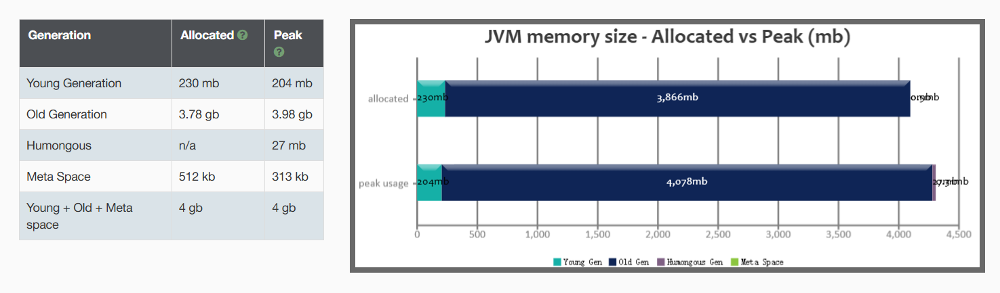

# 附录（GCEasy 实验结果）

首先来看 G1 垃圾收集的结果，我直接给出 gceasy 对结果的分析：

1. g1gc_4g_100_1m.log
   
    首先可以看看 JVM 的内存划分：
    
    
    
    其次可以看看在 G1 GC 的一些关键性能指标，如吞吐量，延迟等：
    
    
    
    其次可以看看在 G1 GC 中每个阶段花费的时间：
    
    
    
    然后可以看看 G1 GC 的过程中，STW 和并发执行的时间消耗：
    
    
    
    最后可以看下导致 G1 GC 的原因：
    
    
    
2. g1gc_4g_200_1m.log
   
    首先可以看看 JVM 的内存划分：
    
    
    
    其次可以看看在 G1 GC 的一些关键性能指标，如吞吐量，延迟等：
    
    
    
    其次可以看看在 G1 GC 中每个阶段花费的时间：
    
    
    
    然后可以看看 G1 GC 的过程中，STW 和并发执行的时间消耗：
    
    
    
    最后可以看下导致 G1 GC 的原因：
    
    
    
3. g1gc_4g_500_1m.log
   
    首先可以看看 JVM 的内存划分：
    
    
    
    其次可以看看在 G1 GC 的一些关键性能指标，如吞吐量，延迟等：
    
    
    
    其次可以看看在 G1 GC 中每个阶段花费的时间：
    
    
    
    然后可以看看 G1 GC 的过程中，STW 和并发执行的时间消耗：
    
    
    
    最后可以看下导致 G1 GC 的原因：
    
    
    
4. g1gc_4g_100_2m.log
   
    首先可以看看 JVM 的内存划分：
    
    
    
    其次可以看看在 G1 GC 的一些关键性能指标，如吞吐量，延迟等：
    
    
    
    其次可以看看在 G1 GC 中每个阶段花费的时间：
    
    
    
    然后可以看看 G1 GC 的过程中，STW 和并发执行的时间消耗：
    
    
    
    最后可以看下导致 G1 GC 的原因：
    
    
    
5. g1gc_4g_200_2m.log
   
    首先可以看看 JVM 的内存划分：
    
    
    
    其次可以看看在 G1 GC 的一些关键性能指标，如吞吐量，延迟等：
    
    
    
    其次可以看看在 G1 GC 中每个阶段花费的时间：
    
    
    
    然后可以看看 G1 GC 的过程中，STW 和并发执行的时间消耗：
    
    
    
    最后可以看下导致 G1 GC 的原因：
    
    
    
6. g1gc_4g_500_2m.log
   
    首先可以看看 JVM 的内存划分：
    
    
    
    其次可以看看在 G1 GC 的一些关键性能指标，如吞吐量，延迟等：
    
    
    
    其次可以看看在 G1 GC 中每个阶段花费的时间：
    
    
    
    然后可以看看 G1 GC 的过程中，STW 和并发执行的时间消耗：
    
    
    
    最后可以看下导致 G1 GC 的原因：
    
    
    
7. g1gc_4g_100_4m.log
   
    首先可以看看 JVM 的内存划分：
    
    
    
    其次可以看看在 G1 GC 的一些关键性能指标，如吞吐量，延迟等：
    
    
    
    其次可以看看在 G1 GC 中每个阶段花费的时间：
    
    
    
    然后可以看看 G1 GC 的过程中，STW 和并发执行的时间消耗：
    
    
    
    最后可以看下导致 G1 GC 的原因：
    
    
    
8. g1gc_4g_200_4m.log
   
    首先可以看看 JVM 的内存划分：
    
    
    
    其次可以看看在 G1 GC 的一些关键性能指标，如吞吐量，延迟等：
    
    
    
    其次可以看看在 G1 GC 中每个阶段花费的时间：
    
    
    
    然后可以看看 G1 GC 的过程中，STW 和并发执行的时间消耗：
    
    
    
    最后可以看下导致 G1 GC 的原因：
    
    
    
9. g1gc_4g_500_4m.log
   
    首先可以看看 JVM 的内存划分：
    
    
    
    其次可以看看在 G1 GC 的一些关键性能指标，如吞吐量，延迟等：
    
    
    
    其次可以看看在 G1 GC 中每个阶段花费的时间：
    
    
    
    然后可以看看 G1 GC 的过程中，STW 和并发执行的时间消耗：
    
    
    
    最后可以看下导致 G1 GC 的原因：
    
    
    
10. g1gc_8g_100_1m.log
    
    首先可以看看 JVM 的内存划分：
    
    
    
    其次可以看看在 G1 GC 的一些关键性能指标，如吞吐量，延迟等：
    
    
    
    其次可以看看在 G1 GC 中每个阶段花费的时间：
    
    
    
    然后可以看看 G1 GC 的过程中，STW 和并发执行的时间消耗：
    
    
    
    最后可以看下导致 G1 GC 的原因：
    
    
    
11. g1gc_8g_200_1m.log
    
    首先可以看看 JVM 的内存划分：
    
    
    
    其次可以看看在 G1 GC 的一些关键性能指标，如吞吐量，延迟等：
    
    
    
    其次可以看看在 G1 GC 中每个阶段花费的时间：
    
    
    
    然后可以看看 G1 GC 的过程中，STW 和并发执行的时间消耗：
    
    
    
    最后可以看下导致 G1 GC 的原因：
    
    
    
12. g1gc_8g_500_1m.log
    
    首先可以看看 JVM 的内存划分：
    
    
    
    其次可以看看在 G1 GC 的一些关键性能指标，如吞吐量，延迟等：
    
    
    
    其次可以看看在 G1 GC 中每个阶段花费的时间：
    
    
    
    然后可以看看 G1 GC 的过程中，STW 和并发执行的时间消耗：
    
    
    
    最后可以看下导致 G1 GC 的原因：
    
    
    
13. g1gc_8g_100_2m.log
    
    首先可以看看 JVM 的内存划分：
    
    
    
    其次可以看看在 G1 GC 的一些关键性能指标，如吞吐量，延迟等：
    
    
    
    其次可以看看在 G1 GC 中每个阶段花费的时间：
    
    
    
    然后可以看看 G1 GC 的过程中，STW 和并发执行的时间消耗：
    
    
    
    最后可以看下导致 G1 GC 的原因：
    
    
    
14. g1gc_8g_200_2m.log
    
    首先可以看看 JVM 的内存划分：
    
    
    
    其次可以看看在 G1 GC 的一些关键性能指标，如吞吐量，延迟等：
    
    
    
    其次可以看看在 G1 GC 中每个阶段花费的时间：
    
    
    
    然后可以看看 G1 GC 的过程中，STW 和并发执行的时间消耗：
    
    
    
    最后可以看下导致 G1 GC 的原因：
    
    
    
15. g1gc_8g_500_2m.log
    
    首先可以看看 JVM 的内存划分：
    
    
    
    其次可以看看在 G1 GC 的一些关键性能指标，如吞吐量，延迟等：
    
    
    
    其次可以看看在 G1 GC 中每个阶段花费的时间：
    
    
    
    然后可以看看 G1 GC 的过程中，STW 和并发执行的时间消耗：
    
    
    
    最后可以看下导致 G1 GC 的原因：
    
    
    
16. g1gc_8g_100_4m.log
    
    首先可以看看 JVM 的内存划分：
    
    
    
    其次可以看看在 G1 GC 的一些关键性能指标，如吞吐量，延迟等：
    
    
    
    其次可以看看在 G1 GC 中每个阶段花费的时间：
    
    
    
    然后可以看看 G1 GC 的过程中，STW 和并发执行的时间消耗：
    
    
    
    最后可以看下导致 G1 GC 的原因：
    
    
    
17. g1gc_8g_200_4m.log
    
    首先可以看看 JVM 的内存划分：
    
    
    
    其次可以看看在 G1 GC 的一些关键性能指标，如吞吐量，延迟等：
    
    
    
    其次可以看看在 G1 GC 中每个阶段花费的时间：
    
    
    
    然后可以看看 G1 GC 的过程中，STW 和并发执行的时间消耗：
    
    
    
    最后可以看下导致 G1 GC 的原因：
    
    
    
18. g1gc_8g_500_4m.log
    
    首先可以看看 JVM 的内存划分：
    
    
    
    其次可以看看在 G1 GC 的一些关键性能指标，如吞吐量，延迟等：
    
    
    
    其次可以看看在 G1 GC 中每个阶段花费的时间：
    
    
    
    然后可以看看 G1 GC 的过程中，STW 和并发执行的时间消耗：
    
    
    
    最后可以看下导致 G1 GC 的原因：
    
    
    
19. g1gc_16g_100_1m.log
    
    首先可以看看 JVM 的内存划分：
    
    
    
    其次可以看看在 G1 GC 的一些关键性能指标，如吞吐量，延迟等：
    
    
    
    其次可以看看在 G1 GC 中每个阶段花费的时间：
    
    
    
    然后可以看看 G1 GC 的过程中，STW 和并发执行的时间消耗：
    
    
    
    最后可以看下导致 G1 GC 的原因：
    
    
    
20. g1gc_16g_200_1m.log
    
    首先可以看看 JVM 的内存划分：
    
    
    
    其次可以看看在 G1 GC 的一些关键性能指标，如吞吐量，延迟等：
    
    
    
    其次可以看看在 G1 GC 中每个阶段花费的时间：
    
    
    
    然后可以看看 G1 GC 的过程中，STW 和并发执行的时间消耗：
    
    
    
    最后可以看下导致 G1 GC 的原因：
    
    
    
21. g1gc_16g_500_1m.log
    
    首先可以看看 JVM 的内存划分：
    
    
    
    其次可以看看在 G1 GC 的一些关键性能指标，如吞吐量，延迟等：
    
    
    
    其次可以看看在 G1 GC 中每个阶段花费的时间：
    
    
    
    然后可以看看 G1 GC 的过程中，STW 和并发执行的时间消耗：
    
    
    
    最后可以看下导致 G1 GC 的原因：
    
    
    
22. g1gc_16g_100_2m.log
    
    首先可以看看 JVM 的内存划分：
    
    
    
    其次可以看看在 G1 GC 的一些关键性能指标，如吞吐量，延迟等：
    
    
    
    其次可以看看在 G1 GC 中每个阶段花费的时间：
    
    
    
    然后可以看看 G1 GC 的过程中，STW 和并发执行的时间消耗：
    
    
    
    最后可以看下导致 G1 GC 的原因：
    
    
    
23. g1gc_16g_200_2m.log
    
    首先可以看看 JVM 的内存划分：
    
    
    
    其次可以看看在 G1 GC 的一些关键性能指标，如吞吐量，延迟等：
    
    
    
    其次可以看看在 G1 GC 中每个阶段花费的时间：
    
    
    
    然后可以看看 G1 GC 的过程中，STW 和并发执行的时间消耗：
    
    
    
    最后可以看下导致 G1 GC 的原因：
    
    
    
24. g1gc_16g_500_2m.log
    
    首先可以看看 JVM 的内存划分：
    
    
    
    其次可以看看在 G1 GC 的一些关键性能指标，如吞吐量，延迟等：
    
    
    
    其次可以看看在 G1 GC 中每个阶段花费的时间：
    
    
    
    然后可以看看 G1 GC 的过程中，STW 和并发执行的时间消耗：
    
    
    
    最后可以看下导致 G1 GC 的原因：
    
    
    
25. g1gc_16g_100_4m.log
    
    首先可以看看 JVM 的内存划分：
    
    
    
    其次可以看看在 G1 GC 的一些关键性能指标，如吞吐量，延迟等：
    
    
    
    其次可以看看在 G1 GC 中每个阶段花费的时间：
    
    
    
    然后可以看看 G1 GC 的过程中，STW 和并发执行的时间消耗：
    
    
    
    最后可以看下导致 G1 GC 的原因：
    
    
    
26. g1gc_16g_200_4m.log
    
    首先可以看看 JVM 的内存划分：
    
    
    
    其次可以看看在 G1 GC 的一些关键性能指标，如吞吐量，延迟等：
    
    
    
    其次可以看看在 G1 GC 中每个阶段花费的时间：
    
    
    
    然后可以看看 G1 GC 的过程中，STW 和并发执行的时间消耗：
    
    
    
    最后可以看下导致 G1 GC 的原因：
    
    
    
27. g1gc_16g_500_4m.log
    
    首先可以看看 JVM 的内存划分：
    
    
    
    其次可以看看在 G1 GC 的一些关键性能指标，如吞吐量，延迟等：
    
    
    
    其次可以看看在 G1 GC 中每个阶段花费的时间：
    
    
    
    然后可以看看 G1 GC 的过程中，STW 和并发执行的时间消耗：
    
    
    
    最后可以看下导致 G1 GC 的原因：
    
    
    

接下来来看 ZGC 垃圾收集的结果：

1. zgc_4g_100.log
   
    首先可以看看 JVM 的内存划分：
    
    
    
    其次可以看看在 ZGC 的一些关键性能指标，如吞吐量，延迟等：
    
    
    
    然后可以看看 ZGC 中每个阶段花费的时间：
    
    
    
    然后可以看看 ZGC 的过程中，STW 和并发执行的时间消耗：
    
    
    
    最后可以看下导致 ZGC 的原因：
    
    
    
2. zgc_4g_200.log
   
    首先可以看看 JVM 的内存划分：
    
    
    
    其次可以看看在 ZGC 的一些关键性能指标，如吞吐量，延迟等：
    
    
    
    然后可以看看 ZGC 中每个阶段花费的时间：
    
    
    
    然后可以看看 ZGC 的过程中，STW 和并发执行的时间消耗：
    
    
    
    最后可以看下导致 ZGC 的原因：
    
    
    
3. zgc_4g_500.log
   
    首先可以看看 JVM 的内存划分：
    
    
    
    其次可以看看在 ZGC 的一些关键性能指标，如吞吐量，延迟等：
    
    
    
    然后可以看看 ZGC 中每个阶段花费的时间：
    
    
    
    然后可以看看 ZGC 的过程中，STW 和并发执行的时间消耗：
    
    
    
    最后可以看下导致 ZGC 的原因：
    
    
    
4. zgc_8g_100.log
   
    首先可以看看 JVM 的内存划分：
    
    
    
    其次可以看看在 ZGC 的一些关键性能指标，如吞吐量，延迟等：
    
    
    
    然后可以看看 ZGC 中每个阶段花费的时间：
    
    
    
    然后可以看看 ZGC 的过程中，STW 和并发执行的时间消耗：
    
    
    
    最后可以看下导致 ZGC 的原因：
    
    
    
5. zgc_8g_200.log
   
    首先可以看看 JVM 的内存划分：
    
    
    
    其次可以看看在 ZGC 的一些关键性能指标，如吞吐量，延迟等：
    
    
    
    然后可以看看 ZGC 中每个阶段花费的时间：
    
    
    
    然后可以看看 ZGC 的过程中，STW 和并发执行的时间消耗：
    
    
    
    最后可以看下导致 ZGC 的原因：
    
    
    
6. zgc_8g_500.log
   
    首先可以看看 JVM 的内存划分：
    
    
    
    其次可以看看在 ZGC 的一些关键性能指标，如吞吐量，延迟等：
    
    
    
    然后可以看看 ZGC 中每个阶段花费的时间：
    
    
    
    然后可以看看 ZGC 的过程中，STW 和并发执行的时间消耗：
    
    
    
    最后可以看下导致 ZGC 的原因：
    
    
    
7. zgc_16g_100.log
   
    首先可以看看 JVM 的内存划分：
    
    
    
    其次可以看看在 ZGC 的一些关键性能指标，如吞吐量，延迟等：
    
    
    
    然后可以看看 ZGC 中每个阶段花费的时间：
    
    
    
    然后可以看看 ZGC 的过程中，STW 和并发执行的时间消耗：
    
    
    
    最后可以看下导致 ZGC 的原因：
    
    
    
8. zgc_16g_200.log
   
    首先可以看看 JVM 的内存划分：
    
    
    
    其次可以看看在 ZGC 的一些关键性能指标，如吞吐量，延迟等：
    
    
    
    然后可以看看 ZGC 中每个阶段花费的时间：
    
    
    
    然后可以看看 ZGC 的过程中，STW 和并发执行的时间消耗：
    
    
    
    最后可以看下导致 ZGC 的原因：
    
    
    
9. zgc_16g_500.log
   
    首先可以看看 JVM 的内存划分：
    
    
    
    其次可以看看在 ZGC 的一些关键性能指标，如吞吐量，延迟等：
    
    
    
    然后可以看看 ZGC 中每个阶段花费的时间：
    
    
    
    然后可以看看 ZGC 的过程中，STW 和并发执行的时间消耗：
    
    
    
    最后可以看下导致 ZGC 的原因：
    
    